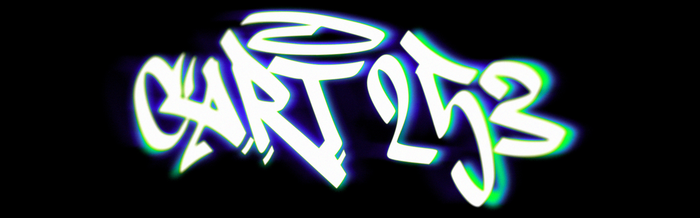
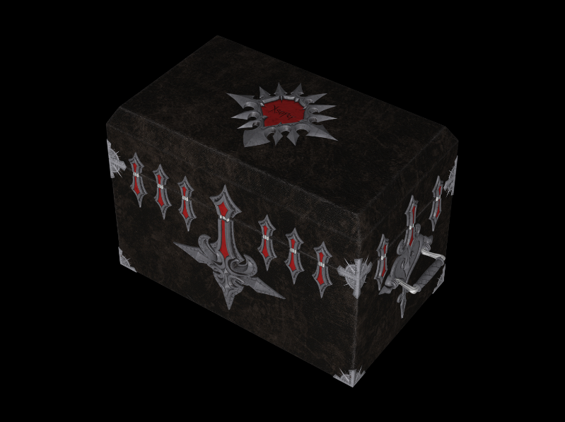
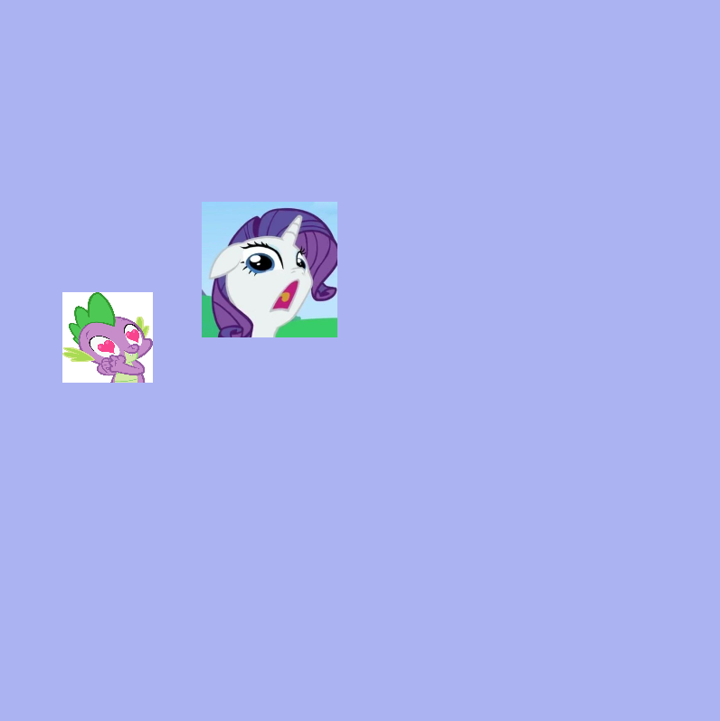

# CART 253
## A repository for CART253

  

This website was made with the purpose of showcase my prototyping work in this course.

## My journal📝

[Click me!](journal.md)

## Where you can find me :D
[Steam](https://steamcommunity.com/profiles/76561199514415842/)

[Backloggd](https://backloggd.com/u/wannabenerd/)

## Landscape prototype✨

[landscape challenge](https://sub5gamingaddict.github.io/cart253/instructions-challenge/) ([soure code](https://github.com/sub5gamingaddict/cart253/tree/main/instructions-challenge))

## Prototyping assignment📝

[Penguin](https://sub5gamingaddict.github.io/cart253/prototypes/penguin/)

  

[source code](https://github.com/sub5gamingaddict/cart253/tree/main/prototypes/penguin)

[ANGRY MOON](https://sub5gamingaddict.github.io/cart253/prototypes/angry-moon/)

  

[source code](https://github.com/sub5gamingaddict/cart253/tree/main/prototypes/angry-moon)

[Stare](https://sub5gamingaddict.github.io/cart253/prototypes/lizard-eyes/)

  

[source code](https://github.com/sub5gamingaddict/cart253/tree/main/prototypes/lizard-eyes)

## Variables:

[Clock](https://sub5gamingaddict.github.io/cart253/prototypes/variables/clock/)

  

[source code](https://github.com/sub5gamingaddict/cart253/tree/main/prototypes/variables/clock)

[Sunrise](https://sub5gamingaddict.github.io/cart253/prototypes/variables/sunrise/)

  

[source code](https://github.com/sub5gamingaddict/cart253/tree/main/prototypes/variables/sunrise)

[Shape Randomizer](https://sub5gamingaddict.github.io/cart253/prototypes/variables/randomizer/)

  

[source code](https://github.com/sub5gamingaddict/cart253/tree/main/prototypes/variables/randomizer)

[Black Box](https://sub5gamingaddict.github.io/cart253/prototypes/conditionals/keyblade-gacha)

  

[source code](https://github.com/sub5gamingaddict/cart253/tree/main/prototypes/conditionals/keyblade-gacha)

[Snow](https://sub5gamingaddict.github.io/cart253/prototypes/conditionals/snow)

  

[source code](https://github.com/sub5gamingaddict/cart253/tree/main/prototypes/conditionals/snow)

[Rarity](https://sub5gamingaddict.github.io/cart253/prototypes/conditionals/GET-AWAY-FROM-ME)

  

[source code](https://github.com/sub5gamingaddict/cart253/tree/main/prototypes/conditionals/GET-AWAY-FROM-ME)
