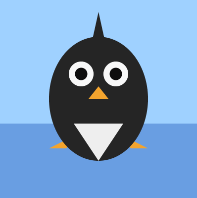
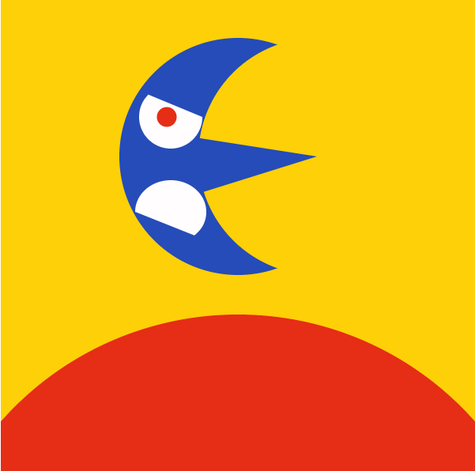

# Reflective journal
## September 12 2026
This went better than i was expected tbh. I was gonna take a random meme from google to use as a banner but then i realised that it was a bad idea and it was BORING! So i decided to DRAW MY OWN :D. The art is supposed to be silly so don't expect anything pretty. who am i kidding tho, you have already seen it so you can't EXPECT anything now.

Making this website with Markdown and Github was suprisingly easy? I was prepared for some rocket science that was gonna send me in severe spiraling existencial crisis but ay, i'm happy that it didn't :D. i'm still figuring out if i can add colors to the text...wait can i do that? let me check. OH I CAN! YES!

after looking at the page again i realised that the art was extremely horrible, also i have to make it match the new color palette so yeah, LET'S CHANGE THAT :D. oh and for reference, here's the old one:

  

i'm writing this journal to talk about my thought process but now that i think about it, my brain is EMPTY. Well what i'm writing rn is indeed my thoughts so i guess that works.

## September 16 2026

i decided to just stick with a simple text as a banner instead of a full on illustration, mainly because i couldn't figure out how to fit a text and characters in such a long composition. i also checked the web version of my repository, and i realised it was white, which basically made my text unreadable because of the colors i chose, so i changed the color in the index html, i couldn't find a way to do this in markdown so yeah.

after what it felt like HOURS (it was a like 30 minutes maximum tbh) of rotating between files and writing a buncha code THAT I HAD NO KNOWLEDGE OF. I was forced to go back to the boring black text D: The background REFUSED to change colors and i couldnt keep the purple, orange and yellowish green text since they were pretty hard to read on a white background, they did look good on the normal github repository tho. I'm sad but there isn't anything i can do about it so yeah. i tried to edit the index.html and style.css but that didn't work either, and it's getting late so i'll call it a day.

This wasn't as complicated as i thought it would be, mainly because i avoided any complicated stuff and sticked to the basics, i mean...idk how to code so yeah. Also for the future audience...i've got no idea how i want to make them feel, tbh i don't have a good grasp in what we will do in the future, but i would like to customize my github page to be more personal and less boring, seriously, i HATE mine rn. As for aspirations, well...i'm an artist not a web developper, i don't really have anyone to look up to for reference, tho i do have an HUGE intereset in ARGs and internet horror, mainly because i was obsessed with FNAF when i was a kid and really liked how the whole community was analyzing the website for clues, most of the hidden messages were hidden in the source code which back in the day was A GENIUS MOVE, but yeah, if i can develop an ARG that makes people feel scared and horrified, that would be pretty cool.

Here's some ugly website screenshots:

  

  

## September 23 2026

So i'm starting this at last minute, hopefully it will be simple and my brain wouldn't stop working...who am i kidding this is literally written after i've already finished.
it's actually 12:53 am rn so it isnt september 23 2026...it's the 24th, but i still haven't passed the deadline so i should be good :D.

##  September 24 2026

after finishing the three prototypes, I can say that i'm suprisingly happy with the results, aspecially considering the fact that i was working on them while being sleep deprived, food deprived AND WITH HUGE HEADACHE (literally). Anyways, I had fun with my time while making these three different prototypes.
I learnt how to make gradients this time! tho... i didn't use it because it just didn't work with what i was supposed to do, and that makes me a little dissapointed but ay, i'm happy. I also found it funny that some of the shapes that i put in my prototypes came from literal accidents, aspecially the third one with the creepy face, a typo caused the lizard sharp eyes and i wasn't going to include them in the original image. I was also cycling between three different variants:

  

  

  

For the penguin one, It was the first thing that came up in mind, mainly because i love penguins...i mean who doesn't? It wasn't anything complicated and it was definetly the easiest out of the three. I tried to put lines on the ice floor like minecraft but that didn't work so...yeah.

  

For the moon, the main inspo was mejora's mask, I always liked how intimidating the moon was in that game, so i tried to replicate that but then i realised that it wasn't going to work out, so i switched to more silly tone.

  

Finally, i wanted to adress the progressive scale increase that you would probably notice when glancing at all three of these prototypes. No it was not intentional. I actually realised that the penguin canvas was way too small but i didn't want to redo it so i decided to include the concept of progressive scaling, that's it, nothing too deep, just an excuse for my laziness :p.