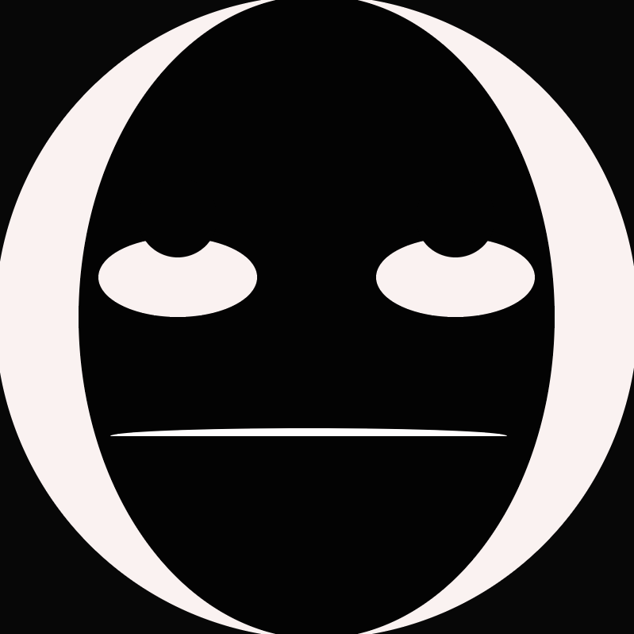
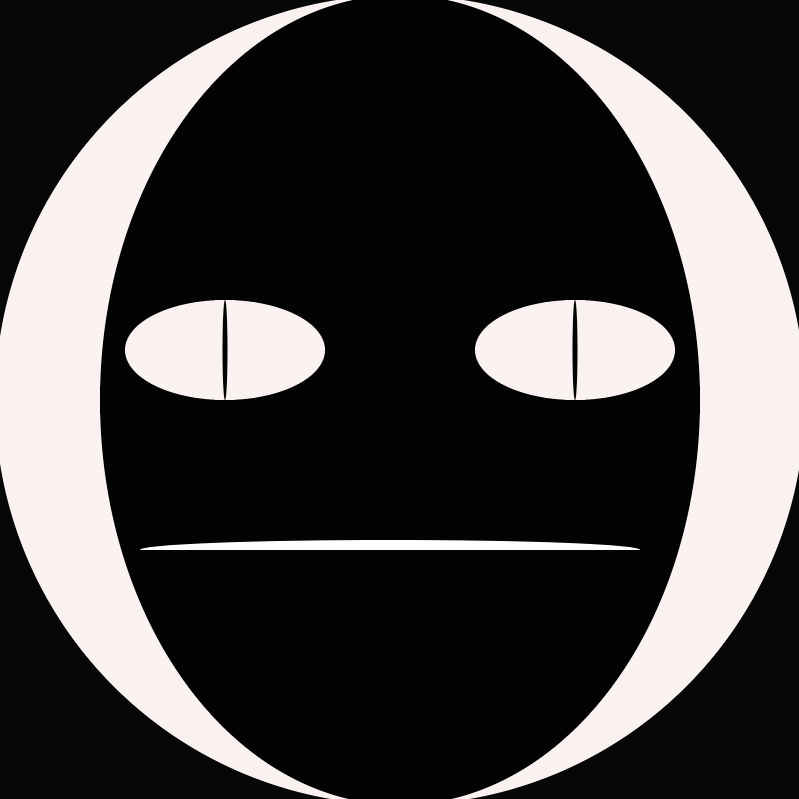

## September 23 2026

So i'm starting this at last minute, hopefully it will be simple and my brain wouldn't stop working...who am i kidding this is literally written after i've already finished.
it's actually 12:53 am rn so it isnt september 23 2026...it's the 24th, but i still haven't passed the deadline so i should be good :D.

##  September 24 2026

after finishing the three prototypes, I can say that i'm suprisingly happy with the results, aspecially considering the fact that i was working on them while being sleep deprived, food deprived AND WITH HUGE HEADACHE (literally). Anyways, I had fun with my time while making these three different prototypes.
I learnt how to make gradients this time! tho... i didn't use it because it just didn't work with what i was supposed to do, and that makes me a little dissapointed but ay, i'm happy. I also found it funny that some of the shapes that i put in my prototypes came from literal accidents, aspecially the third one with the creepy face, a typo caused the lizard sharp eyes and i wasn't going to include them in the original image. I was also cycling between three different variants:

  

  

  

before i ended up with the final one:

  

For the penguin one, It was the first thing that came up in mind, mainly because i love penguins...i mean who doesn't? It wasn't anything complicated and it was definetly the easiest out of the three. I tried to put lines on the ice floor like minecraft but that didn't work so...yeah.

  

For the moon, the main inspo was mejora's mask, I always liked how intimidating the moon was in that game, so i tried to replicate that but then i realised that it wasn't going to work out, so i switched to more silly tone.

  

Finally, i wanted to adress the progressive scale increase that you would probably notice when glancing at all three of these prototypes. No it was not intentional. I actually realised that the penguin canvas was way too small but i didn't want to redo it so i decided to include the concept of progressive scaling, that's it, nothing too deep, just an excuse for my laziness :p.

    
    
    

