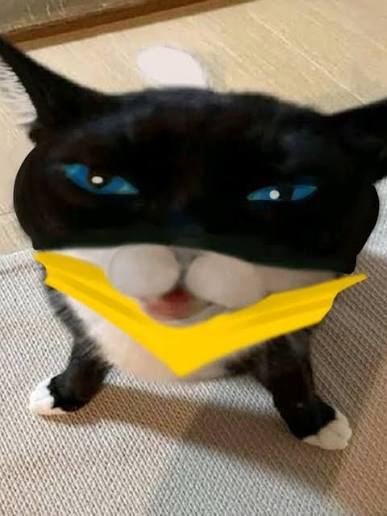

# IDK WHAT IM DOING

Wassim

[View this project online](https://khglazer.github.io/cart253/topics/version-control/version-control-workflow/)

## Description

This description should help the reader understand what the program is, anything they should know to be able to experience it (controls, special features, etc.), and what the desired user experience is. For example:

> morgana is a little dumb cat from persona 5.

> the image has nothing to do with the game, if you can even call it a game.

> as you can tell, i got no idea what i'm doing.
## Screenshot(s)

not a single thought in the brain of this cat T-T:

> 

## Attribution

STUFF I SNATCHED FROM THE INTERNET:

> - This project uses [p5.js](https://p5js.org).
> - the morgana picture is from google, it's an edited picture of a real cat that was painted on to resemble and reference the video game character.

## License

is this under a license? i found the license written in the template so imma just leave it ig💔

> This project is licensed under a Creative Commons Attribution ([CC BY 4.0](https://creativecommons.org/licenses/by/4.0/deed.en)) license with the exception of libraries and other components with their own licenses.